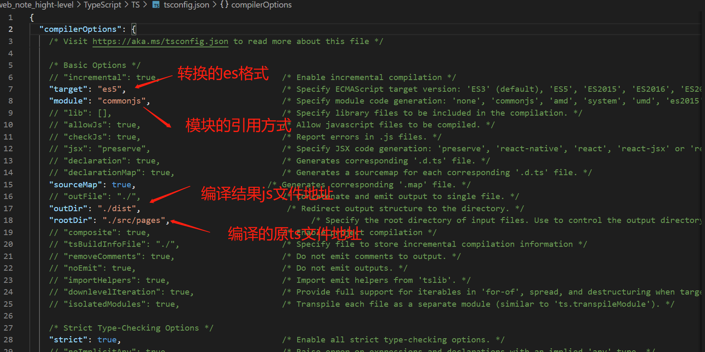

# TypeScript
JavaScript的超集，增加了类型系统及对ES6+特性支持/自动转换的扩展，最后编译为JavaScript；相较于flow，作为一种完整的语言，TypeScript功能更加强大，生态也更加完善。

### 安装使用

```
yarn init --yes //yarn初始化项目
yarn add typescript --dev //安装ts
yarn tsc 文件名//编译单个ts文件为js文件
```

### 配置文件

```
yarn tsc --init //初始化 创建ts配置文件 tsconfig.json
yarn tsc //根据配置文件，将指定文件内的ts文件编译为js文件，并放到指定的文件夹中
```

>### 标准库声明 
>标准库就是内置对象所对应的声明，ts想要应用es内置对象，需在tsconfig中的lib中添加对应的标准库名称，见tsconfig.json配置文件。



### 类型赋值范围

- 基本类型

```
const a:string = 'string' 
const b:number = Infinity //NaN // 100
const c:boolean = true //false
//前三种类型 在非严格模式下 可以为 null/undefined
const d: void = undefined //空类型 非严格模式下 可以为 null
const e:null = null
const f:undefined = undefined
const g:symbol = Symbol()
```

- Object类型

```
const h:object = function(){} //[]//{} //指的是所有非原始类型
const i:{foo:number,bar:string} = {foo:123,bar:'str'} //属性不能多也不能少
```
>更多的是应用接口来定义对象类型

- 数组类型

```
const arr1:Array<number> = [1,2,3]
const arr2:number[] = [1,2,3]

function sum(...args:number[]) { //不必在内部进行类型判断
    return args.reduce((prev,current) => prev + current , 0)
}

sum(1,2,3)
```

- 元组类型
元组就是一个明确元素数量和每个元素类型的数组

```
const tuple: [number,string] = [123,'str']
```

- 枚举类型
枚举类型在，不设置里面键的值或者第一个键赋值为一个number时，会自动赋值累加；直接通过enum定义的枚举在ts编译为一个双向的键值对对象(也就是可以通过键获取值，也可以通过值获取键)；可通过const去定义常量枚举去除，并直接赋值。

```
enum PostStatus {
    Draft = 'str',
    published= 1,
    unpublished = 0
}
const enum PostStatus {
    Draft = 'str',
    published= 1,
    unpublished = 0
}
```

- 函数类型

```
function func1(a:number,b:number,c?:number):string {return 'func1'}//函数声明：可选参数可以用?或者赋予默认值
const func2: (a: number, b: number) => string = function(a:number,b:number):string {return 'func2'}//函数表达式
```

- 任意类型
any 可接收，赋值各种类型，ts不会对其做类型检查，因此也会有类型安全隐患，建议减少使用

```
function stringify(value:any) {
    return JSON.stringify(value)
}
```
### 隐式类型推断
在ts中，未给代码规定明确的类型，ts会根据第一次赋值的类型，进行类型推断，再赋值时须类型一致；若未赋值，则类型推断为any，之后可以赋值任意不同类型；尽量为每一个变量规定明确的类型，减少隐式类型推断。

### 类型断言
在开发中，我们知道一些返回值的明确类型，但是ts不确定，会导致之后的逻辑代码报错，这是我们可以通过类型断言，告诉ts，这个返回值一定会是某一类型；

```
const nums = [1001,1002,1003];
const res = nums.find(i => i>0);
// const square = res * res;//因为ts 不清楚find是否会找到符合当前条件的值，因此返回值res 有可能是 number 或者 undefined，因此 res * res 会报错
const num1 = res as number;
const num2 = <number>res;//由于尖括号的原因，JSX中不能使用，因此常用as
```

### 接口
ts中接口约束对象，具体有哪些成员，以及成员的类型

```
interface Post {//定义接口
    title: string;
    content: string;
    subtitle?: string;//可选成员
    readonly summary: string;//只读成员
};
function printPost(post: Post) {
    console.log(post.title)
    console.log(post.content)
}
printPost({title:'interface',content:'hi',summary:'readonly'})
//定义动态成员接口
interface Catch {[prop:string]:string} 
const catchi: Catch = {};
catchi.foo = 'value1';
catchi.bar = 'value2'
```

### 类
- 类的声明，属性必须有初始值，无论是声明时，还是构造函数中赋值；

```
class Person{
    name:string;
    age:number;
    constructor(name:string,age:number) {
        this.name = name;
        this.age = age;
    }
}
const personW= new Person('wx',27)
```
- 类的访问修饰符

控制类中属性的可访问级别

public：公共；private：私有，只允许类内部调用，不能被实例以及子类应用；protected：保护，只允许子类继承应用；readonly：只读属性

constructor构造函数也可设置private修饰符，这样就不能直接通过new创建实力，而是需要在类的内部通过静态方法创建
```
class Person{
    public name:string;
    private age:number;
    protected readonly gender: boolean;
    constructor(name:string,age:number) {
        this.name = name;
        this.age = age;
        this.gender = true;
    }
    sayHi(msg:string):void {
        console.log(`I am ${this.name},${msg}`)
        console.log(this.age)
    }
}
class Students extends Person {
    private constructor(name:string,age:number) {
        super(name,age)
        console.log(this.gender)
    }
    static create(name:string,age:number) {
        return new Students(name,age)
    } 
}
const tom= new Person('tom',18);
console.log(tom.name);
// console.log(tom.age);//无法获取
// console.log(tom.gender);//无法获取
const jack = Students.create('jack',19);
```

### 类与接口
不同类之间也会出现相同的属性，这些相同的属性可定义接口去约束
```
interface Eat {
    eat(foo:string):void
}
interface Run {
    run(distance:number):void
}
class Human implements Eat,Run{
    eat(food:string):void {
        console.log(`优雅的进食${food}`)
    }
    run(distance:number):void {
        console.log(`直立行走${distance}`)
    }
}
class Animal implements Eat,Run{
    eat(food:string):void {
        console.log(`狼吞虎咽${food}`)
    }
    run(distance:number):void {
        console.log(`爬行${distance}`)
    }
}
```
### 抽象类
一个笼统的类，即可包含抽象的属性方法，也可包含具体的实现；只能被继承，不能直接new实例；

```
abstract class Animals {
    eat(food:string):void {
        console.log(`狼吞虎咽${food}`)
    }
    abstract run(distance:number):void;//抽象方法
}
class dog extends Animals {
    run(distance: number): void {//继承抽象类时，必须实例抽象类中的抽象方法
        console.log(`爬行${distance}`)
    }
}
```

### 泛型
指在定义函数、接口、类的时候，不去指定具体类型，在使用时再指定类型；目的是极大程度上复用代码；

```
function createStringArray(length:number,value:string):string[] {
    const arr = Array<string>(length).fill(value);
    return arr
}
function creatArray<T>(length:number,value:T):T[] {//泛型定义
    const arr = Array<T>(length).fill(value);
    return arr
}
const stringArr = creatArray<string>(3,'ts');
```

### 类型声明
在安装和使用其他npm模块时，可能会由于模块的方法未声明类型导致出现错误提示，大多数npm模块已经提供了ts类型声明，只需要根据提示安装相应的类型声明文件；此外如果没有此类声明模块可以在引入后使用declare为其单独声明其类型；


[ts项目示例](/TypeScript/TS)