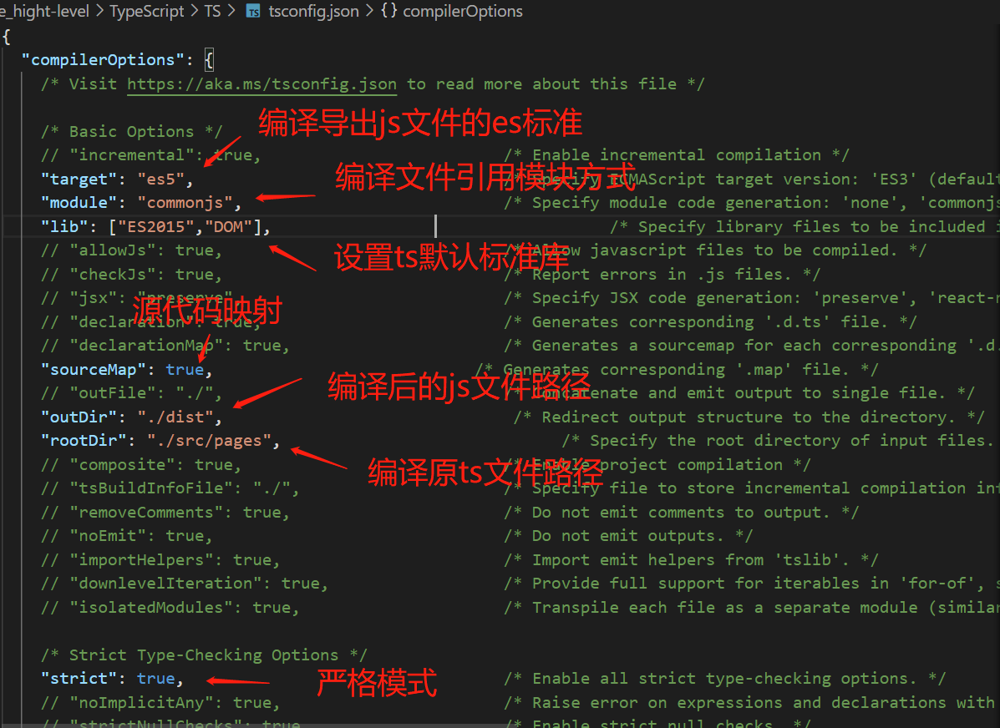

# TypeScript
JavaScript的超集，增加了类型系统及对ES6+特性支持/自动转换的扩展，最后编译为JavaScript；相较于flow，作为一种完整的语言，TypeScript功能更加强大，生态也更加完善。

### 安装使用

```
yarn init --yes //yarn初始化项目
yarn add typescript --dev //安装ts
yarn tsc 文件名//编译单个ts文件为js文件
```

### 配置文件

```
yarn tsc --init //初始化 创建ts配置文件 tsconfig.json
yarn tsc //根据配置文件，将指定文件内的ts文件编译为js文件，并放到指定的文件夹中
```

>### 标准库声明 
>标准库就是内置对象所对应的声明，ts想要应用es内置对象，需在tsconfig中的lib中添加对应的标准库名称，见tsconfig.json配置文件。



### 基本类型

```
const a:string = 'string' 
const b:number = Infinity //NaN // 100
const c:boolean = true //false
//前三种类型 在非严格模式下 可以为 null/undefined
const d: void = undefined //空类型 非严格模式下 可以为 null
const e:null = null
const f:undefined = undefined
const g:symbol = Symbol()
```

### Object类型

```
const h:object = function(){} //[]//{} //指的是所有非原始类型
const i:{foo:number,bar:string} = {foo:123,bar:'str'} //属性不能多也不能少
```
>更多的是应用接口来定义对象类型

### 数组类型

```
const arr1:Array<number> = [1,2,3]
const arr2:number[] = [1,2,3]

function sum(...args:number[]) { //不必在内部进行类型判断
    return args.reduce((prev,current) => prev + current , 0)
}

sum(1,2,3)
```

### 元组类型
元组就是一个明确元素数量和每个元素类型的数组

```
const tuple: [number,string] = [123,'str']
```

### 枚举类型
枚举类型在，不设置里面键的值或者第一个键赋值为一个number时，会自动赋值累加；直接通过enum定义的枚举在ts编译为一个双向的键值对对象(也就是可以通过键获取值，也可以通过值获取键)；可通过const去定义常量枚举去除，并直接赋值。

```
enum PostStatus {
    Draft = 'str',
    published= 1,
    unpublished = 0
}
const enum PostStatus {
    Draft = 'str',
    published= 1,
    unpublished = 0
}
```

### 函数类型

```
function func1(a:number,b:number,c?:number):string {return 'func1'}//函数声明：可选参数可以用?或者赋予默认值
const func2: (a: number, b: number) => string = function(a:number,b:number):string {return 'func2'}//函数表达式
```

[ts项目示例](/TypeScript/TS)